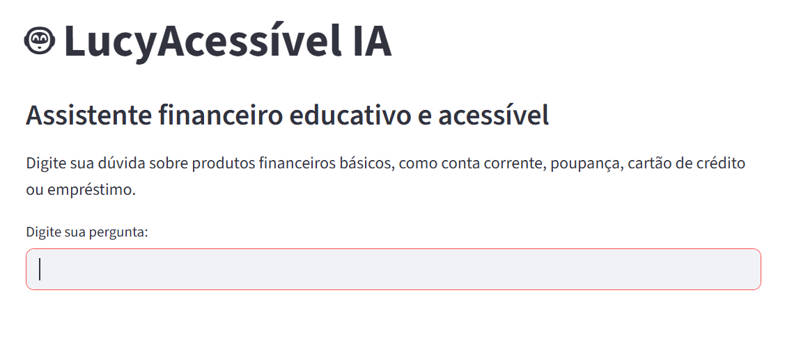
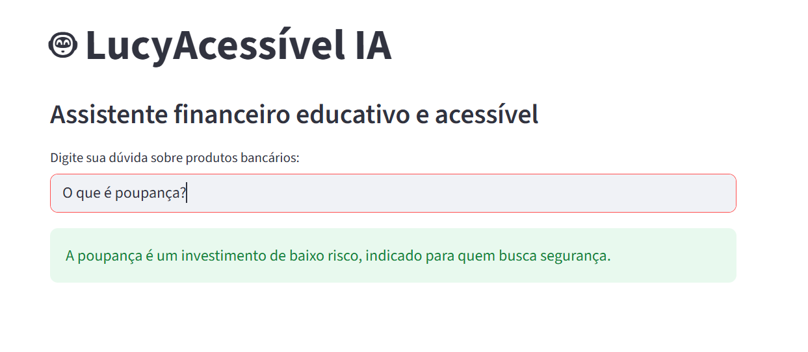

# 📸 Recursos Visuais do Projeto

Esta pasta é destinada aos recursos visuais da aplicação **LucyAcessível IA**, contendo evidências reais do funcionamento do chatbot desenvolvido em Streamlit.

As imagens abaixo demonstram a interface e o comportamento do agente em diferentes cenários de uso.

---

## 🖥️ Tela Inicial do Chatbot

Imagem da tela inicial da aplicação ao ser executada, exibindo a interface simples e acessível do chatbot.

---

## 🚫 Tratamento de Pergunta Fora do Escopo

Exemplo de pergunta que não faz parte do escopo do agente e a resposta segura e controlada retornada pelo sistema.

---

## ✅ Tratamento de Pergunta Válida

Exemplo de pergunta correta sobre produtos financeiros básicos e a resposta determinística fornecida pelo agente.

---

📌 **Observação:**  
Essas imagens servem como comprovação visual do funcionamento do protótipo, facilitando a avaliação por professores, recrutadores e revisores.
