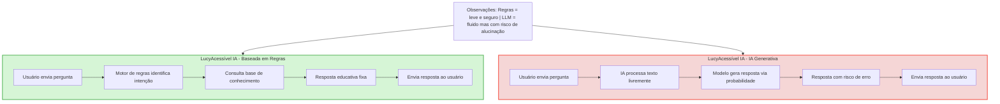

# Documentação do Agente

## Caso de Uso

### Problema

Muitas pessoas têm dificuldade em compreender produtos financeiros como contas bancárias e crédito, devido ao uso de linguagem técnica, excesso de informações e falta de acessibilidade.

### Solução

O agente atua como um assistente financeiro acessível, capaz de explicar produtos bancários de forma clara e simples.
Utilizando **análise simples de texto baseada em palavras-chave** e um motor de regras, o agente identifica a intenção do usuário e retorna respostas educativas, seguras e acessíveis, sem depender de APIs pagas ou modelos proprietários.

### Público-Alvo

- Pessoas que desejam entender melhor produtos financeiros básicos.
- Clientes bancários iniciantes.
- Instituições interessadas em soluções financeiras inclusivas.

---

## Persona e Tom de Voz

### Nome-do-Agente

**LucyAcessível IA**
(Assistente Financeiro Inclusivo)

### Personalidade

O agente possui uma personalidade educativa, priorizando clareza e inclusão. Ele evita termos técnicos desnecessários e se adapta ao nível de entendimento do usuário.

### Tom de Comunicação

- Acessível
- Claro
- Não técnico
- Educacional

### Exemplos de Linguagem

**Confirmação:** "A poupança é uma forma simples de guardar dinheiro. Ela rende um pouco e é indicada para reservas financeiras".  

**Erro/Limitação:** "Ainda não tenho informações sobre isso. Posso ajudar com conta corrente, poupança, cartão de crédito ou empréstimo."

---

## Arquitetura

O agente **LucyAcessível IA** foi desenvolvido com foco em **acessibilidade, segurança e controle das respostas**.  

Ele utiliza um **motor de regras simples**, consultando uma **base de conhecimento estruturada**, para gerar respostas educativas, claras e confiáveis.  

O diagrama abaixo compara o fluxo do projeto atual (rule-based) com uma possível implementação usando IA generativa, mostrando diferenças em leveza, controle e risco de alucinação.

### Diagrama
<!-- Diagrama comparativo: Rule-Based vs IA Generativa -->

---

### Legenda das cores

- Verde (Rule-Based) → fluxo leve, totalmente controlado e seguro
- Vermelho (IA Generativa) → fluxo fluido e natural, mas pesado, com risco de respostas fora do controle

### Componentes

| Componente | Descrição |
| --------- | ---------- |
| Interface | Aplicação web em Streamlit, com foco em acessibilidade |
| Análise de Texto | Identificação de intenção baseada em palavras-chave |
| Motor de Regras | Analisa a intenção do usuário e retorna respostas pré-definidas |
| Base de Conhecimento | Dicionário Python com explicações sobre produtos financeiros |
| Validação | Garante respostas controladas e dentro do escopo |

## Segurança e Anti-Alucinação

### Estratégias Adotadas

- [x] Agente responde apenas com base no conteúdo definido no código
- [x] Não gera conteúdo livre ou inferências
- [x] Quando não reconhece a intenção, retorna resposta neutra
- [x] Não realiza recomendações financeiras personalizadas

### Limitações Declaradas

O agente não:

- Realiza transações financeiras
- Acessa dados reais de clientes
- Faz recomendações de investimento
- Substitui um consultor financeiro humano
- Utiliza modelos de IA proprietários ou APIs pagas.

### Considerações de Acessibilidade

> O projeto foi desenvolvido seguindo princípios de acessibilidade digital:

- Interface textual compatível com leitores de tela
- Linguagem simples e objetiva
- Alto contraste e fonte legível
- Navegação possível por teclado
- Respostas curtas com opção de explicação simplificada.

### Contexto Educacional

Parte do Bootcamp DIO + Bradesco, com foco em:

- Inteligência Artificial
- Python
- Dados
- UX e Acessibilidade
- Ética em IA

### Observação Final

- O fluxo **rule-based** garante respostas determinísticas, educativas e seguras, ideal para iniciantes ou usuários com necessidades de acessibilidade
- O fluxo **IA generativa** é mais natural, porém exige mais recursos e apresenta risco de alucinação; por isso, não foi adotado
- Essa abordagem facilita a explicação do funcionamento do agente no pitch de 3 minutos
- Mantém transparência e reprodutibilidade no GitHub

---
