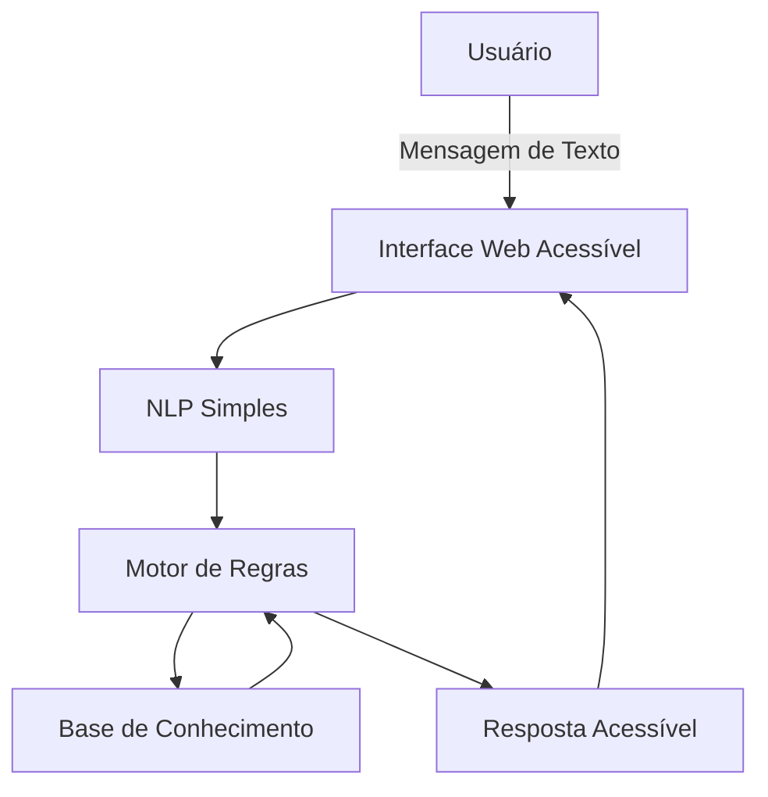

# Documentação do Agente

## Caso de Uso

### Problema

Muitas pessoas têm dificuldade em compreender produtos financeiros como contas bancárias e crédito, devido ao uso de linguagem técnica, excesso de informações e falta de acessibilidade. Pessoas com deficiência visual, auditiva, motora ou cognitiva enfrentam ainda mais barreiras no acesso a informações financeiras claras, seguras e inclusivas.

### Solução

O agente atua como um assistente financeiro acessível, capaz de explicar produtos bancários de forma clara e simples.
Utilizando processamento de linguagem natural simples e um motor de regras, o agente identifica a intenção do usuário, consulta uma base de conhecimento estruturada e retorna respostas educativas, seguras e adaptadas à acessibilidade, sem depender de APIs pagas ou modelos proprietários.

### Público-Alvo

- Pessoas que desejam entender melhor produtos financeiros básicos.
- Clientes bancários iniciantes.
- Pessoas com deficiência (visual, auditiva, motora ou cognitiva).
- Instituições interessadas em soluções financeiras inclusivas.

---

## Persona e Tom de Voz

### Nome do Agente
LucyAcessível IA
(Assistente Financeiro Inclusivo)

### Personalidade

O agente possui uma personalidade educativa, empática, priorizando clareza, paciência e inclusão. Ele evita termos técnicos desnecessários e se adapta ao nível de entendimento do usuário.

### Tom de Comunicação

- Acessível
- Claro
- Não técnico
- Respeitoso
- Educacional

### Exemplos de Linguagem

- Saudação: "Olá! Estou aqui para te ajudar a entender produtos financeiros de forma simples e acessível."
- Confirmação: "Entendi sua dúvida! Vou te explicar isso agora."
- Erro/Limitação: "Ainda não tenho essa informação, mas posso te ajudar com explicações sobre contas ou crédito."

---

## Arquitetura

### Diagrama

### Componentes

| Componente   |   Descrição  | 
|--------------|--------------| 
| Interface | Aplicação web desenvolvida em Streamlit, com foco em acessibilidade | 
| NLP Simples | Identificação de intenções por palavras-chave e normalização de texto | 
| Motor de Regras | Define respostas com base na intenção detectada | 
| Base de Conhecimento | Arquivos JSON/CSV com dados sobre produtos financeiros | 
| Validação | Evita respostas fora da base de conhecimento |

---

## Segurança e Anti-Alucinação

### Estratégias Adotadas

- [x] Agente só responde com base nos dados fornecidos
- [x] Respostas incluem fonte da informação
- [x] Quando não sabe, admite e redireciona
- [x] Não faz recomendações financeiras sem perfil do cliente
- [x] Simulações são educativas e demonstrativas
- [x] Linguagem clara e não persuasiva

### Limitações Declaradas

O agente não:

- Realiza transações financeiras
- Acessa dados reais de clientes
- Faz recomendações de investimento
- Substitui um consultor financeiro humano
- Utiliza modelos de IA proprietários ou APIs pagas.

### Considerações de Acessibilidade

> O projeto foi desenvolvido seguindo princípios de acessibilidade digital:

- Interface textual compatível com leitores de tela
- Linguagem simples e objetiva
- Alto contraste e fonte legível
- Navegação possível por teclado
- Respostas curtas com opção de explicação simplificada.

### Contexto Educacional

> Este projeto foi desenvolvido como parte do Bootcamp DIO + Bradesco, com foco em consolidar conhecimentos em:

- Inteligência Artificial,
- Python,
- Dados,
- UX e Acessibilidade,
- Ética em IA.

### Observação Final

O LucyAcessível IA demonstra que é possível construir soluções inteligentes, éticas e inclusivas utilizando tecnologias abertas, gratuitas e explicáveis, reforçando o compromisso com inovação responsável no setor financeiro.
